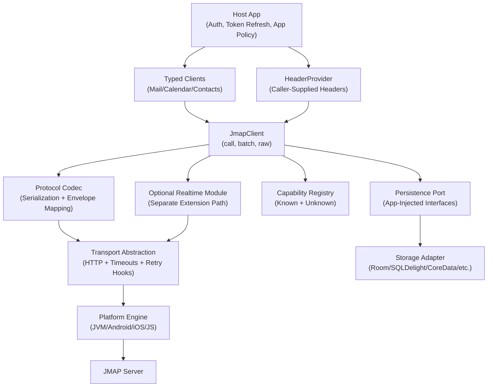
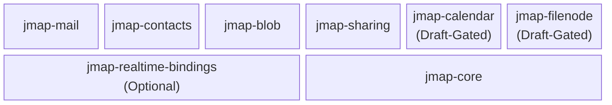
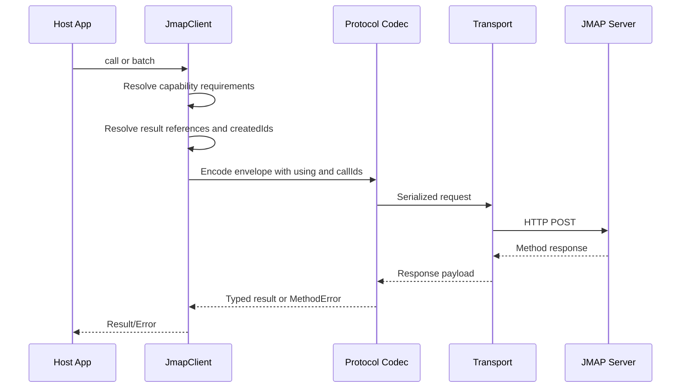
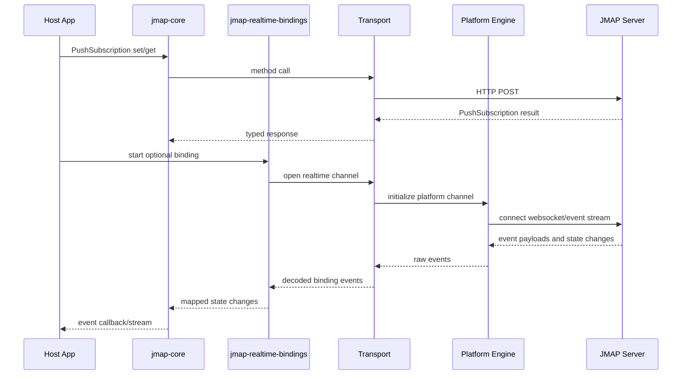
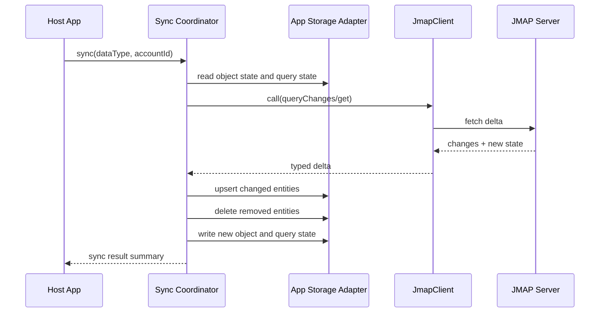

# Architecture Baseline: Kotlin Multiplatform JMAP Library

## Document status

- Status: Baseline architecture for Milestone 2
- Scope: Documentation only (no runtime implementation in this step)
- Intended audience: contributors, reviewers, and implementers

## 1) Purpose and goals

### Goals

- Build a Kotlin Multiplatform JMAP library for `JVM`, `Android`, `iOS`, and `JS`.
- Provide a typed-first API for stable standards (`Core`, `Mail`, `Contacts`) and draft-gated APIs for evolving standards (for example `Calendar`, `FileNode`).
- Provide a raw escape hatch for unknown or vendor-specific methods.
- Preserve unknown JSON fields to remain forward compatible with extensions.
- Keep authentication external to the library via caller-provided headers.
- Define persistence boundaries for synchronized state while keeping storage implementation app-injected.
- Support optional realtime transport bindings without coupling them into core synchronous flows.

### Non-goals for this baseline

- No production implementation code.
- No Gradle/scaffold setup in this step.
- No module-level docs files yet (`docs/modules/*` is next).
- No example docs yet (`docs/examples/*` is next).

### v1 boundaries

- In v1 API scope:
  - Session discovery and capability handling
  - Method invocation (`call`, `batch`, `raw`) with explicit envelope semantics (`using`, `callId`, result references, `createdIds`)
  - Stable domain modules for Mail and Contacts
  - Core push subscription model and state-change handling
- Out of v1 core:
  - Stable typed APIs for still-draft standards (for example Calendar and FileNode) until they are RFC-published
  - Built-in OAuth flows and token storage
  - Mandatory websocket/event-stream bindings in core runtime path

## 2) Architecture overview

## Layered model

1. Public API layer
2. Protocol/codec layer
3. Transport abstraction layer
4. Platform engine layer



## Module boundaries



| Module | Layer | Primary responsibilities | Depends on | Constraints and notes |
| --- | --- | --- | --- | --- |
| `jmap-core` | Core protocol and orchestration | Session bootstrap, capability negotiation, call/batch/raw contracts, sync orchestration hooks, persistence port contracts, envelope and error model, push subscription/state-change handling | Serialization and transport abstractions | Must stay storage-framework agnostic and must not depend on domain modules |
| `jmap-mail` | Public typed API | Typed Mail methods and models | `jmap-core` | Domain-only logic, no direct transport implementation |
| `jmap-calendar` | Public typed API (draft-gated) | Typed Calendar methods and models | `jmap-core` | Domain-only logic, no direct transport implementation; draft-only (`draft-ietf-jmap-calendars`) until RFC publication |
| `jmap-contacts` | Public typed API | Typed Contacts methods and models | `jmap-core` | Domain-only logic, no direct transport implementation |
| `jmap-blob` | Public typed API | Typed blob lifecycle methods and models (`Blob/*`) | `jmap-core` | RFC 9404 stable surface; domain-only logic, no direct transport implementation |
| `jmap-filenode` | Public typed API (draft-gated) | Typed file hierarchy methods and models (`FileNode/*`) | `jmap-core` | Draft-only (`draft-ietf-jmap-filenode`); feature-flagged and version-pinned |
| `jmap-sharing` | Public typed API | Typed sharing and ACL-related methods and models | `jmap-core` | RFC 9670 stable sharing substrate; domain-only logic, no direct transport implementation |
| `jmap-realtime-bindings` (optional) | Optional extension | WebSocket/event-stream binding integration for push/event transport | `jmap-core`, transport abstraction | Transport binding only; core push state and subscription lifecycle remain in `jmap-core` |
| `jmap-testing` | Test support | Shared fixtures, fake/mocked transport adapters, cross-module contract assertions | `jmap-core`, domain modules | No production runtime responsibilities |

## Standards alignment and maturity

| Standard | Capability | Planned module | Maturity | Notes |
| --- | --- | --- | --- | --- |
| RFC 8620 (Core) | `urn:ietf:params:jmap:core` | `jmap-core` | Stable RFC | Foundation for session, envelope semantics, push subscription objects |
| RFC 8621 (Mail) | `urn:ietf:params:jmap:mail` | `jmap-mail` | Stable RFC | Primary domain scope for v1 |
| RFC 9610 (Contacts) | `urn:ietf:params:jmap:contacts` | `jmap-contacts` | Stable RFC | In v1 typed domain scope |
| RFC 9404 (Blob) | `urn:ietf:params:jmap:blob` | `jmap-blob` | Stable RFC | Keep distinct from FileNode draft surface |
| RFC 9670 (Sharing) | `urn:ietf:params:jmap:principals` | `jmap-sharing` | Stable RFC | Cross-domain sharing substrate |
| RFC 8887 (WebSocket) | `urn:ietf:params:jmap:websocket` | `jmap-realtime-bindings` | Stable RFC | Optional transport binding, not core requirement |
| RFC 9749 (Web Push VAPID) | `urn:ietf:params:jmap:webpush-vapid` | `jmap-core` + bindings | Stable RFC | Key rotation and push registration behavior |
| RFC 9425 (Quota) | `urn:ietf:params:jmap:quota` | `jmap-core` extension surface | Stable RFC | Typed extension planned after baseline |
| RFC 9661 (Sieve) | `urn:ietf:params:jmap:sieve` | future `jmap-sieve` | Stable RFC | Planned post-baseline typed module |
| RFC 9007 (MDN) | `urn:ietf:params:jmap:mdn` | `jmap-mail` extension surface | Stable RFC | Mail-adjacent extension |
| RFC 9219 (S/MIME verify) | `urn:ietf:params:jmap:smimeverify` | `jmap-mail` extension surface | Stable RFC | Mail query/get property extension |
| draft-ietf-jmap-calendars | `urn:ietf:params:jmap:calendars` | `jmap-calendar` | Internet-Draft | Feature-flagged, version-pinned, no stability guarantee |
| draft-ietf-jmap-filenode | `urn:ietf:params:jmap:filenode` | `jmap-filenode` | Internet-Draft | Feature-flagged, version-pinned, no stability guarantee |

## Persistence boundary (application-injected)

- Persistence is represented as interfaces owned by the library boundary.
- The host application injects concrete adapters (for example Room, SQLDelight, CoreData, IndexedDB wrappers).
- Core logic may read/write sync anchors and entity mutations through interfaces only.
- The library must not directly import storage framework APIs.

## 3) Interaction and data flow

## Session and capability bootstrap

1. Host app initializes client with endpoint + `HeaderProvider`.
2. Client fetches session metadata.
3. Capability registry stores known and unknown capabilities.
4. Domain clients verify required capability before method dispatch.

## Method call lifecycle

- Batch request envelope includes `using`, ordered `methodCalls`, and deterministic `callId` values.
- Result references and `createdIds` are resolved by core request orchestration before typed result mapping.



## Push lifecycle (core model + optional transport bindings)

- Push subscription objects and state-change semantics are handled by `jmap-core`.
- Optional realtime modules provide transport bindings only (for example WebSocket or event stream).



## State sync and persistence lifecycle



## Batch lifecycle

- Preserve call ids and response ordering semantics from protocol envelope.
- Preserve `createdIds` semantics across chained method invocations in a single request.
- Represent partial failure without discarding successful responses.
- Return structured `BatchResult` with successful and failed call entries.

## Error mapping

- Capability errors: fail fast before transport if missing required capabilities.
- Invocation graph errors: invalid result references, unresolved `resultOf`, invalid JSONPath projection.
- Request-level errors: malformed request envelope and server-level `requestError` responses.
- Method-level errors: JMAP method error payloads, including typed `SetError` mappings.
- Protocol envelope errors: invalid response structure and mismatched call-id/result associations.
- Transport errors: connectivity/timeouts/HTTP gateway failures.

## 4) Public API contract

The following contracts are architecture-level requirements.

```kotlin
interface JmapClient {
    suspend fun <R : Any> call(method: MethodCall<R>, options: CallOptions = CallOptions()): R
    suspend fun batch(request: BatchRequest, options: CallOptions = CallOptions()): BatchResult
    suspend fun raw(request: RawJmapRequest, options: CallOptions = CallOptions()): RawJmapResponse
}

data class BatchRequest(
    val using: Set<CapabilityId>,
    val methodCalls: List<MethodCallEnvelope>,
    val createdIds: Map<String, String> = emptyMap(),
)

data class MethodCallEnvelope(
    val callId: String,
    val name: String,
    val arguments: JsonObject,
)

sealed interface ResultReference {
    data class Path(val resultOf: String, val path: String) : ResultReference
}

fun interface HeaderProvider {
    suspend fun headers(): Map<String, String>
}

interface SessionProvider {
    suspend fun get(): JmapSession
}

interface SyncStateStore {
    suspend fun readObjectState(accountId: String, dataType: String): String?
    suspend fun writeObjectState(accountId: String, dataType: String, state: String)
    suspend fun readQueryState(accountId: String, dataType: String, queryKey: String): String?
    suspend fun writeQueryState(accountId: String, dataType: String, queryKey: String, state: String)
}

interface EntityStore<T : Any, Id : Any> {
    suspend fun upsert(items: List<T>)
    suspend fun deleteByIds(ids: List<Id>)
}
```

## API contract rules

- Typed-first API for supported protocol methods.
- Raw escape hatch for unsupported/experimental/vendor extensions.
- No built-in auth orchestration; host app owns token lifecycle.
- Persistence implementation is app-injected; library depends on storage interfaces only.
- Unknown capability and model fields must be preserved and round-trippable.
- Batch requests must expose protocol envelope semantics (`using`, ordered `methodCalls`, `callId`, result references, `createdIds`).
- Draft-backed typed APIs must be capability-gated, feature-flagged, and version-pinned.

## Key types to lock

- `JmapSession` with known + unknown capability map.
- `CapabilityId` with known variants and unknown fallback.
- `MethodCall`, `BatchRequest`, `MethodCallEnvelope`, `ResultReference`, `BatchResult`, `MethodError`, and raw envelope types.

## 5) Cross-platform strategy

## Target support

- `JVM`: server-side and desktop compatibility.
- `Android`: mobile runtime support.
- `iOS`: native interoperability via KMP.
- `JS`: browser/node client compatibility.

## Platform model

- Keep protocol and model logic in shared/common source sets.
- Keep transport abstractions common, inject platform engine implementation.
- Keep persistence interfaces common, inject platform-specific storage adapters from the host app.
- Isolate platform-specific concerns behind common interfaces.

## Behavioral expectations across targets

- Consistent JSON serialization/deserialization behavior.
- Consistent cancellation and timeout semantics.
- Consistent method error mapping semantics.

## 6) Reliability and compatibility

## Reliability model

- Retries are policy-driven and opt-in via transport/config hooks.
- Core invocation path remains deterministic and side-effect transparent.
- Timeout and cancellation must propagate predictably to caller.
- Persist new sync state only after local entity mutations are durably applied.
- Entity upsert/delete flows should be idempotent to tolerate retries.
- Push state-change handling remains in core even when optional transport bindings are disabled.

## Compatibility model

- Semantic versioning for published API surface.
- Backward compatibility for `1.x` except explicitly documented majors.
- Additive evolution preferred over breaking type renames/removals.
- Unknown fields preserved to support forward-compatible extensions.
- RFC-backed APIs are semver-stable; draft-backed APIs are explicitly experimental and may change between draft revisions.

## Data handling constraints

- Do not log authentication secrets.
- Keep error objects structured and safe for diagnostics.
- Maintain method call id traceability in batch and error paths.

## 7) TDD and verification strategy

## TDD mapping to Milestone 4

| Milestone 4 stream | Architecture section validated |
| --- | --- |
| Core envelope/session/push tests | Sections 2, 3, 4, 6 |
| `jmap-mail` tests | Sections 2, 4, 5 |
| `jmap-contacts` tests | Sections 2, 4, 5 |
| `jmap-blob` tests | Sections 2, 4, 5 |
| Draft-gated module tests (`jmap-calendar`, `jmap-filenode`) | Sections 2, 4, 6 |
| Raw escape hatch tests | Sections 3, 4, 6 |
| Sync + persistence adapter tests | Sections 3, 4, 6 |
| Cross-target smoke tests | Sections 5, 6 |

## Acceptance gates for this architecture baseline

1. Every planned module has clear responsibilities and dependencies.
2. API contract is explicit for typed + raw flows and auth boundaries.
3. Flow diagrams match narrative behavior.
4. Reliability and compatibility constraints are explicit.
5. Milestone 4 tasks trace back to architecture sections.
6. Standards matrix clearly separates stable RFC and draft-gated scope.

## 8) ADRs (architecture decisions)

### ADR-001 Typed-first API with raw escape hatch

- Decision: Expose typed API as default and raw invocation for extensions.
- Rationale: Balance developer ergonomics and protocol flexibility.
- Consequence: Need both strict typed tests and generic envelope tests.

### ADR-002 Externalized authentication

- Decision: Auth is caller-owned via `HeaderProvider`.
- Rationale: Avoid coupling to OAuth vendor/token storage policy.
- Consequence: Library docs/examples must always show authenticated usage.

### ADR-003 Unknown-field preservation

- Decision: Preserve unknown JSON fields for capabilities and models.
- Rationale: Forward compatibility with evolving JMAP servers/extensions.
- Consequence: Serialization layer must support round-trip of unknown fields.

### ADR-004 Core push with optional realtime bindings

- Decision: Push subscription/state semantics stay in core while realtime transport bindings remain optional modules.
- Rationale: Align with RFC 8620 push primitives while keeping transport strategy pluggable.
- Consequence: Core must expose stable push APIs independent of websocket/event-stream availability.

### ADR-005 Capability-gated domain dispatch

- Decision: Domain methods validate capability presence before dispatch.
- Rationale: Fail fast with clear errors and avoid avoidable network calls.
- Consequence: Domain clients require capability metadata contracts.

### ADR-006 Cross-platform behavior consistency

- Decision: Shared protocol behavior with platform-isolated transport engine.
- Rationale: Predictable behavior for consumers across all supported targets.
- Consequence: Cross-target smoke tests are mandatory before release.

### ADR-007 Application-injected persistence

- Decision: Persistence is abstracted via library-owned interfaces and implemented by host application adapters.
- Rationale: Preserve portability across targets and avoid coupling to a single storage framework.
- Consequence: Sync features must be tested against adapter contracts, not concrete DB implementations.

### ADR-008 Draft-gated standards policy

- Decision: APIs for Internet-Draft standards are feature-flagged, capability-gated, and version-pinned until RFC publication.
- Rationale: Preserve correctness and avoid accidental stable guarantees for evolving wire contracts.
- Consequence: Draft modules require explicit opt-in and may change on draft revision updates.

## 9) Review checklist for this document

- Does this architecture match `README.md` goals and scope?
- Are public API boundaries explicit and testable?
- Are module boundaries implementation-ready?
- Does the standards alignment table correctly map each feature to RFC-stable vs draft-gated scope?
- Are cross-platform constraints clear enough for scaffold and tests?
- Are ADR consequences concrete enough to guide coding decisions?
